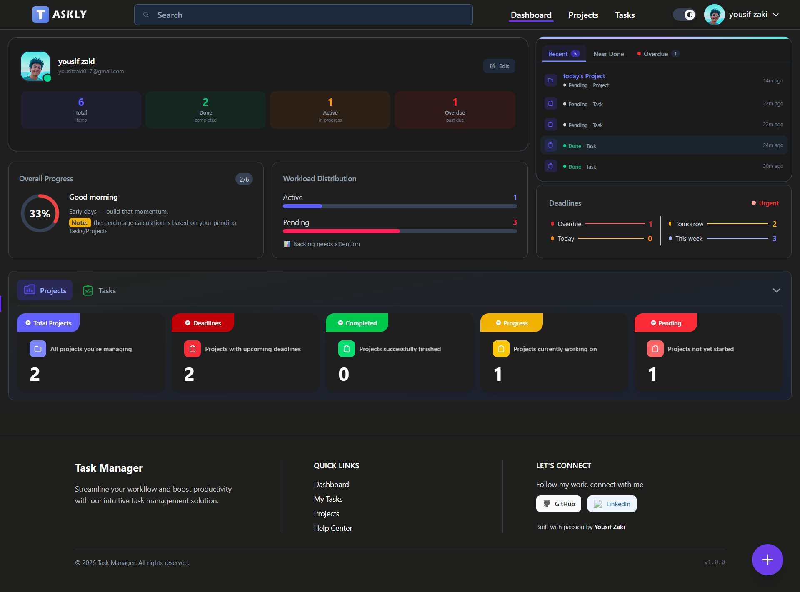
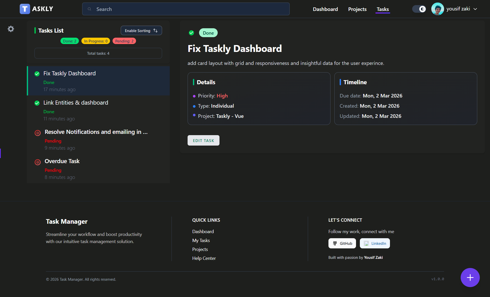
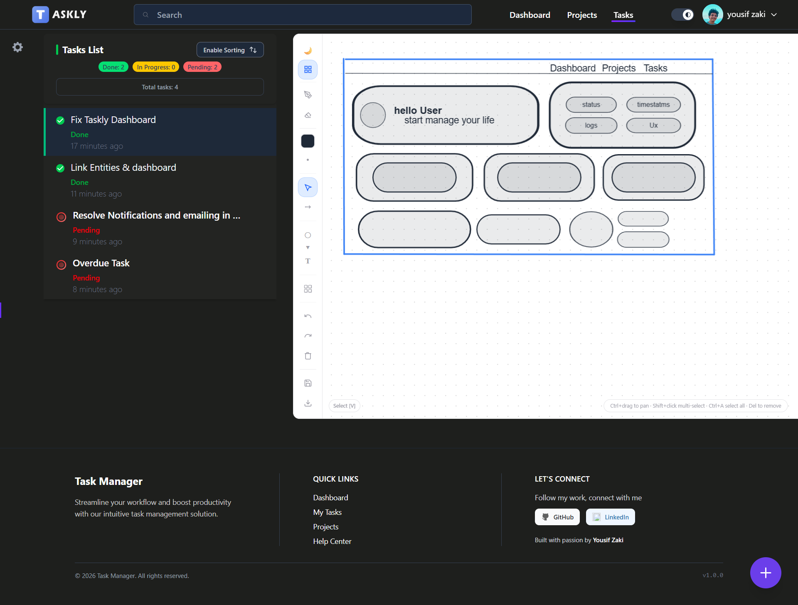

# TaskFlow — Task Management Web App

> A full-stack task management application built with **Laravel** and **Vue.js**

**🔗 Live Demo:** [https://illustrious-gentleness-production-8b3f.up.railway.app/](https://illustrious-gentleness-production-8b3f.up.railway.app/)

---

## Overview

TaskFlow is a decoupled web application that separates concerns between a **Laravel RESTful API backend** and a **reactive Vue.js frontend**. Users can manage tasks through structured list and calendar views, assign statuses, sort and filter across projects — all with real-time state updates powered by Pinia.

---

## Application Preview

### Dashboard
Displays tasks in a structured list format with create, update, delete, and drag-to-sort functionality.



### List View
Displays tasks in a structured list format with create, update, delete, and drag-to-sort functionality.



### Canvas
dispaly Entity Canvas drawing, text, options, styles and more like microsoft word.



### Calendar View
Visualizes tasks on a calendar for date-based planning and scheduling.

 #Upcomming ...

### Task Status Management
Assign and update task statuses to track progress through workflow stages.

 # Upcomming ...

---

## Key Features

- ✅ Full CRUD for tasks and projects
- 📋 List view with drag-to-sort (Sortable.js)
- 📅 Calendar view for date-based task planning
- 🔄 Task status assignment and updates
- 🔍 Sorting and filtering
- ⚡ Reactive state management with Pinia
- 🔐 Authentication with protected routes
- 🏗️ Service layer for centralized, reusable queries
- 🌐 RESTful API with hybrid SSR + CSR rendering

---

## Architecture

The app uses a **hybrid rendering approach**: page shells are served via Laravel SSR (Blade), while task and project entities are managed client-side by Vue CSR.

### Request Lifecycle

```
User Action
  → Pinia Store dispatches via apiRequest.js (Axios wrapper)
    → Laravel Auth + Middleware validates request
      → Controller delegates to Service layer
        → Eloquent queries MySQL
          → JSON response returned
            → Pinia updates state → Vue re-renders UI
```

### Project Structure

| Layer | Files |
|---|---|
| Models | `Task`, `Project` |
| Services | `TaskService`, `ProjectService` — centralized Eloquent queries |
| API Controllers | `TaskControllerApiVue`, `ProjectControllerApiVue` — Vue-facing routes |
| SSR Controllers | `TaskController`, `ProjectController` — Blade page rendering |

---

## Authentication

Built on **Laravel Breeze** with custom UI:

- Custom login and registration pages
- Password reset via email
- Profile management (name, email, password)
- All task/project routes protected by auth middleware

---

## Tech Stack

### Backend
- **Laravel** — PHP framework
- **MySQL** — relational database
- **Eloquent ORM** — database abstraction
- **Laravel Breeze** — authentication scaffolding

### Frontend
- **Vue.js 3** — reactive frontend framework
- **Pinia** — state management
- **Composition API** — component logic
- **Tailwind CSS** — styling
- **Sortable.js** — drag-and-drop sorting
- **Axios** — HTTP client via custom `apiRequest.js` helper

---

## Deployment

Hosted on **Railway**

<p align="center">
  <a href="https://laravel.com" target="_blank">
    
  </a>
  &nbsp;&nbsp;&nbsp;
  <a href="https://vuejs.org" target="_blank">
    
  </a>
</p>
